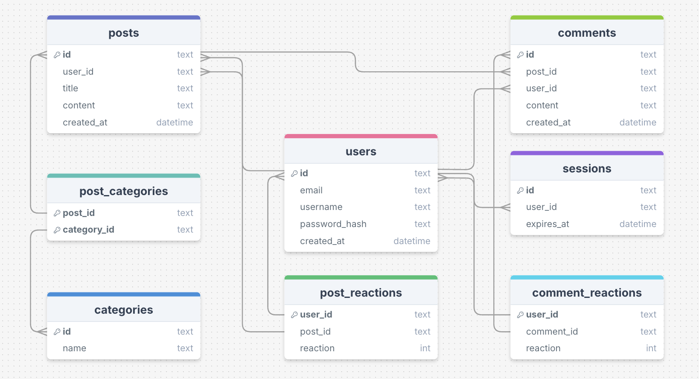

# Forum Project

A lightweight web forum built with **Go**, **SQLite**, and **HTML templates** (with CSS and JavaScript).  
This project uses Docker for easy setup and deployment.

## Features
- Go backend with clean architecture
- SQLite database (default, but configurable)
- HTML templates for server-side rendering
- Static assets (CSS & JS)
- Configurable via environment variables
- Ready for Docker build & run

---

## Project Structure

```
.
├── backend/             # Go backend source code
│   ├── cmd/             # Application entry point
│   ├── internal/        # Internal packages
│   └── …
├── web/
│   ├── static/          # CSS, JS, images
│   └── templates/       # HTML templates
├── Dockerfile
└── README.md
```
---

## Database ER Diagram



## Environment Variables

| Variable         | Default Value                | Description |
|------------------|------------------------------|-------------|
| `SERVER_PORT`    | `8080`                       | Server port |
| `STATIC_DIR`     | `./web/static`               | Path to static files |
| `TEMPLATE_DIR`   | `./web/templates`            | Path to templates |
| `STATIC_PATH`    | `./../frontend/static`       | Frontend static path |
| `TEMPLATE_PATH`  | `./../frontend/templates`    | Frontend template path |
| `DATABASE_DRIVER`| `sqlite3`                    | Database driver |
| `DB_PATH`        | `./../backend/forum.db`      | Path to database file |
| `PROVIDER`       | `sqlite`                     | DB provider |
| `COOKIE_NAME`    | `session_id`                 | Session cookie name |

---

## Building & Running with Docker

### 1. Build the image
```bash
docker build -t forum-app .
```

### 2. Run the container
```bash
docker run -d \
  --name forum-container \
  -p 8080:8080 \
  -e SERVER_PORT=8080 \
  -e DB_PATH="./forum.db" \
  forum-app
```

## Accessing the Container

To enter the running container:
```bash
docker exec -it forum-container sh
```

---

## Development (without Docker)
```bash
go run ./backend/cmd/main.go
```

---

## License

This project is licensed under the MIT License.
